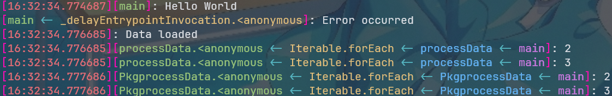

# LOutput 函数文档

#### 概述

`LOutput` 是一个增强的 Dart 日志输出函数，支持多种输出模式和彩色显示，便于调试和日志分析。

---

## 参数说明

#### 消息参数(共五个)

-   `message` - 主要消息内容（必需）

-   `second` - 第二个消息片段（可选）

-   `third` - 第三个消息片段（可选）

-   `fourth` - 第四个消息片段（可选）

-   `fifth` - 第五个消息片段（可选）

#### 调试参数

-   **`level`** - **调用栈层级**
    -   **类型**: `int`
    -   **默认值**: `1`
    -   **说明**: 显示多少层函数调用关系

-   **`mode`**: 输出模式
    -   **类型**: `OutputMode` 枚举
    -   **默认值**: `OutputMode.full`

#### 输出模式(`OutputMode`)

-   `OutputMode.plain`: 仅输出原始文本

-   `OutputMode.timeOnly`: 显示时间 + 文本

-   `OutputMode.chainOnly`: 显示调用链 + 文本

-   `OutputMode.full`: 显示时间 + 调用链 + 文本（默认）

---

## 功能特性

#### 🎨 彩色输出

-   **时间戳**: 彩色显示

-   **调用链**: 每个方法名使用不同颜色

-   **箭头符号**: 固定青色显示

-   **括号**: 灰色显示

#### 🔗 调用链追踪

自动构建方法调用关系，格式：`方法 A <- 方法 B <- 方法 C`

#### ⏰ 时间显示

显示当前时间的 `ISO8601` 格式（精确到秒）

---

## 使用示例

```dart
import 'LOutput.dart';

void main() {
  LOutput('Hello World');

  LOutput('Error occurred', level: 2, mode: OutputMode.chainOnly);

  LOutput('Data loaded', mode: OutputMode.timeOnly);

  processData();
}

void processData() {
  [0, 1, 2, 3].where((num) => (num >= 2)).forEach((num) {
    LOutput(num, level: 4); // 显示4层调用栈
  });
}

```

## 输出



---
